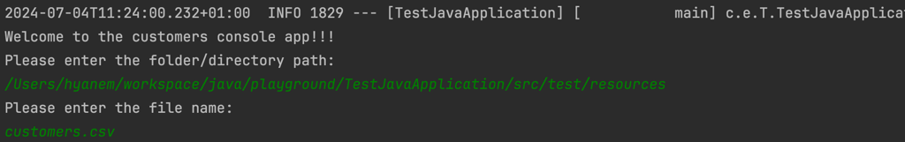

# Test Java Application 
## The aim
This is a simple app with the following functionalities
1. Ability to upload customers when the app is starting up
This is done by entering the folder/directory name and fileName when prompted on the console

2. There is a REST API to GET individual customers using referenceId

